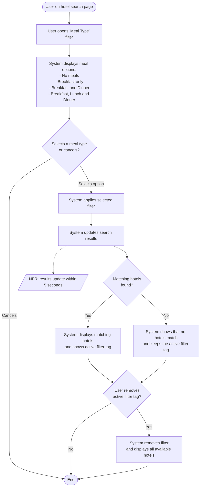

# Feature: Hotel Search Filtering
## Use Case: Filter hotels by meal type 

```mermaid
flowchart TD
    Start([User on hotel search page]) --> Open[User opens 'Meal Type' filter]
    Open --> Options["System displays meal options:<br/>- No meals<br/>- Breakfast only<br/>- Breakfast and Dinner<br/>- Breakfast, Lunch and Dinner"]
    
    Options --> Decision1{Selects a meal type<br/>or cancels?}
    
    Decision1 -- Cancels --> End([End])
    
    Decision1 -- Selects option --> Apply[System applies selected filter]
    Apply --> Update[System updates search results]
    Update -.-> NFR[/"NFR: results update within 5 seconds"/]
    Update --> HasResults{Matching hotels<br/>found?}

    HasResults -- Yes --> Display[System displays matching hotels<br/>and shows active filter tag]
    HasResults -- No --> Empty[System shows that no hotels match<br/>and keeps the active filter tag]

    Display --> Decision2{User removes<br/>active filter tag?}
    Empty --> Decision2

    Decision2 -- No --> End
    Decision2 -- Yes --> Remove[System removes filter<br/>and displays all available hotels]
    Remove --> End
```

